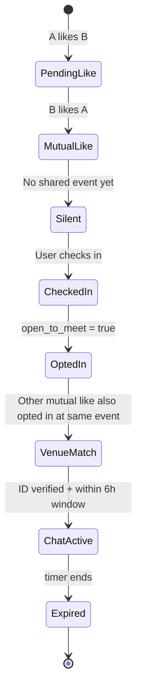

# In the Wild — Product Specification

**Version:** 0.1 (MVP scaffold)  
**URL (dev):** https://rorhoff.com/in-the-wild/  
**API prefix:** `/api/in-the-wild`  
**Tagline:** *Match where you actually are.*

---

## 1. Vision

In the Wild combines modern swipe-based discovery with **real-world context**. Users express interest by swiping, but **cannot message until both people are at the same verified event or venue** and have explicitly opted in with **"Open to Meeting Matches"**.

The goal is to replace weeks of texting with a short, time-boxed window that encourages an in-person introduction while people are already out doing things they enjoy.

---

## 2. Core principles

| Principle | Implementation |
|-----------|----------------|
| Interest ≠ access | Mutual likes are stored silently; no chat until venue match |
| Consent at the moment | "Open to Meeting" is per check-in, off by default |
| Time-boxed chat | 6-hour messaging window after venue unlock |
| Safety first | ID verification required for messaging; optional background check badge |
| Privacy | Never reveal presence until mutual like + mutual opt-in at same event |

---

## 3. User stories

### Discovery & interest

| ID | As a… | I want to… | So that… |
|----|-------|------------|----------|
| US-01 | New visitor | Read the concept and join a waitlist | I can follow launch updates |
| US-02 | User | Create a profile with photos and interests | Others can discover me |
| US-03 | User | Swipe through nearby-compatible profiles | I can express interest without commitment |
| US-04 | User | Pass on someone | They don't reappear soon |
| US-05 | User | See who I've liked (pending) | I know my pipeline without messaging |

### Events & venue matching

| ID | As a… | I want to… | So that… |
|----|-------|------------|----------|
| US-10 | User | Browse verified upcoming events | I know where matching can happen |
| US-11 | User | Check in when I arrive at an event | The app knows I'm there |
| US-12 | User | Toggle "Open to Meeting Matches" | I control whether I'm discoverable at this event |
| US-13 | User | Leave opt-in off while on a date/with family | Nobody is notified I'm present |
| US-14 | System | Detect mutual like + same event + both opt-in | A venue match is created |
| US-15 | User | Get notified "You're both here" | I know it's time to say hello in person |

### Messaging & expiry

| ID | As a… | I want to… | So that… |
|----|-------|------------|----------|
| US-20 | Matched user | Send short messages for ~6 hours | I can coordinate a quick meet-up |
| US-21 | User | See countdown until match expires | I'm nudged to act, not ghost |
| US-22 | System | Expire chat after window | The product stays focused on IRL |

### Trust & safety

| ID | As a… | I want to… | So that… |
|----|-------|------------|----------|
| US-30 | User | Verify my identity | Others trust I'm real |
| US-31 | User | Optionally complete a background check | I signal extra safety (premium) |
| US-32 | User | Block or report someone | I can leave unsafe situations |
| US-33 | System | Require ID verification before chat unlock | Minors/catfish friction |

---

## 4. User flows (wireframes)

### 4.1 Landing (unauthenticated)

```
┌─────────────────────────────────────────────────────────────┐
│  [About] [LinkedIn] [API Testing] … [In the Wild ●]         │
├─────────────────────────────────────────────────────────────┤
│                                                             │
│     🌿  IN THE WILD                                         │
│     Match where you actually are.                           │
│                                                             │
│     [ Swipe mock cards animation ]                          │
│                                                             │
│     ● Swipe interest  ● Meet at events  ● 6hr chat window │
│                                                             │
│     [ Join waitlist ]          [ Sign in to beta ]          │
│                                                             │
│     email ___________________  [ Notify me ]                │
└─────────────────────────────────────────────────────────────┘
```

### 4.2 Discover (authenticated)

```
┌─────────────────────────────────────────────────────────────┐
│  Discover                                    [Profile ⚙]    │
├─────────────────────────────────────────────────────────────┤
│         ┌─────────────────────┐                             │
│         │      [ photo ]      │                             │
│         │  Alex, 28           │                             │
│         │  Hiking · Live music│                             │
│         │  "Here for concerts"│                             │
│         └─────────────────────┘                             │
│              [ ✕ Pass ]    [ ♥ Like ]                       │
├─────────────────────────────────────────────────────────────┤
│  Discover │ Events │ Matches │ Profile                      │
└─────────────────────────────────────────────────────────────┘
```

### 4.3 Event check-in + opt-in

```
┌─────────────────────────────────────────────────────────────┐
│  Events                                                     │
├─────────────────────────────────────────────────────────────┤
│  ┌─ Summer Fest 2026 ────────────────────────────────┐     │
│  │  Today · 4pm–11pm · Riverfront Park               │     │
│  │  [ Check in ]                                      │     │
│  └────────────────────────────────────────────────────┘     │
│                                                             │
│  After check-in:                                            │
│  ┌─ You're checked in ────────────────────────────────┐     │
│  │  Open to Meeting Matches          [ OFF │ ON ]    │     │
│  │  When ON, mutual likes here can unlock a match.    │     │
│  └────────────────────────────────────────────────────┘     │
└─────────────────────────────────────────────────────────────┘
```

### 4.4 Venue match unlocked

```
┌─────────────────────────────────────────────────────────────┐
│  🎉 You're both at Summer Fest!                             │
│                                                             │
│  You and Jordan both liked each other and opted in.         │
│  Say hello in person — chat expires in 5h 42m.              │
│                                                             │
│  [ Open chat ]        [ Not now ]                           │
└─────────────────────────────────────────────────────────────┘
```

### 4.5 Timed chat

```
┌─────────────────────────────────────────────────────────────┐
│  ← Jordan          ⏱ 5:42:00 left                          │
├─────────────────────────────────────────────────────────────┤
│                    Hey! I'm by the main stage               │
│  ┌──────────────────────────────────┐                     │
│  │ Same! Wearing a green jacket     │                     │
│  └──────────────────────────────────┘                     │
│  _______________________________________  [ Send ]          │
└─────────────────────────────────────────────────────────────┘
```

---

## 5. Match engine



**Rules:**

1. Likes are directional; passes are recorded to avoid re-showing (MVP: 30-day cooldown).
2. Venue match requires: mutual like, same `event_id`, both active check-ins with `open_to_meet = true`.
3. Chat opens only if at least one user has `id_verified = true` (both encouraged).
4. `chat_expires_at = matched_at + 6 hours`.
5. Leaving geofence or toggling opt-in off does **not** revoke an active match; it prevents new ones.

---

## 6. Data model

| Table | Purpose |
|-------|---------|
| `t1inthewild_user` | Auth + profile + verification flags |
| `t1inthewild_session` | Bearer sessions |
| `t1inthewild_waitlist` | Landing page emails |
| `t1inthewild_like` | Swipe decisions (`like` / `pass`) |
| `t1inthewild_event` | Verified venues/events with geofence + schedule |
| `t1inthewild_check_in` | User presence + `open_to_meet` toggle |
| `t1inthewild_match` | Venue-unlocked pairs + expiry |
| `t1inthewild_message` | Chat messages per match |
| `t1inthewild_verification` | ID / background check records |

---

## 7. REST API (v0.1)

Base: `/api/in-the-wild`

### Public

| Method | Path | Description |
|--------|------|-------------|
| GET | `/status` | Health, schema readiness, feature flags |
| POST | `/waitlist` | `{ email, name?, city? }` |
| POST | `/register` | Create account |
| POST | `/login` | Bearer token |
| GET | `/events` | List active/upcoming events (public preview) |

### Authenticated

| Method | Path | Description |
|--------|------|-------------|
| GET | `/me` | Current profile |
| PATCH | `/me` | Update profile |
| POST | `/logout` | Revoke session |
| GET | `/discover` | Next profiles to swipe |
| POST | `/swipe` | `{ target_id, action: "like"\|"pass" }` |
| GET | `/likes/pending` | Outgoing likes awaiting mutual + venue |
| POST | `/events/{id}/check-in` | `{ lat, lng }` — geofence validated |
| PATCH | `/check-in` | `{ open_to_meet: boolean }` |
| DELETE | `/check-in` | Leave event |
| GET | `/matches` | Active + recent matches |
| GET | `/matches/{id}/messages` | Chat history |
| POST | `/matches/{id}/messages` | `{ body }` |
| POST | `/verification/id/start` | Stub — Stripe Identity (phase 2) |

### Response shapes (examples)

**Profile (`GET /me`):**
```json
{
  "id": "uuid",
  "username": "alex",
  "display_name": "Alex",
  "bio": "...",
  "avatar_url": "...",
  "interests": ["hiking", "live music"],
  "id_verified": false,
  "background_verified": false
}
```

**Match (`GET /matches`):**
```json
{
  "id": "uuid",
  "other_user": { "id": "...", "display_name": "Jordan", "avatar_url": "..." },
  "event": { "id": "...", "name": "Summer Fest 2026" },
  "matched_at": "2026-06-17T18:00:00Z",
  "chat_expires_at": "2026-06-18T00:00:00Z",
  "status": "active"
}
```

---

## 8. Venue verification (phased)

| Phase | Mechanism |
|-------|-----------|
| **MVP** | Admin-seeded events; GPS geofence (radius_m); time window |
| **v0.2** | Eventbrite / Ticketmaster API import |
| **v0.3** | QR check-in codes distributed by venues |
| **v1.0** | Partner venues, optional beacons |

---

## 9. Verification (phased)

| Phase | ID verification | Background check |
|-------|-----------------|------------------|
| **MVP** | Manual admin flag + UI stub | Badge placeholder |
| **v0.2** | Stripe Identity | — |
| **v0.3** | — | Checkr integration (user-paid) |

---

## 10. MVP scope (this scaffold)

**In scope:**

- Landing page + waitlist
- Auth (register / login / sessions)
- Profile CRUD
- Discover + swipe
- Seeded events + GPS check-in + opt-in toggle
- Venue match creation + 6-hour chat
- Portfolio integration on rorhoff.com

**Out of scope (later):**

- Push notifications
- Stripe Identity / Checkr
- Ticket API integrations
- Native mobile apps
- Photo upload (avatar URL text field for now)

---

## 11. Success metrics

- Waitlist signups
- DAU with at least one swipe
- Check-ins with opt-in rate
- Venue matches per event
- % of matches with ≥1 message sent
- Time-to-first-message after venue unlock

---

## 12. Open questions

1. **Age gate:** Hard 18+ at registration vs. ID verification only?
2. **Large venues:** Sub-zones (stage vs. beer garden) in v0.2?
3. **Same-gender / orientation filters:** Required for MVP or phase 2?
4. **Launch geography:** Single metro vs. festival-first?
